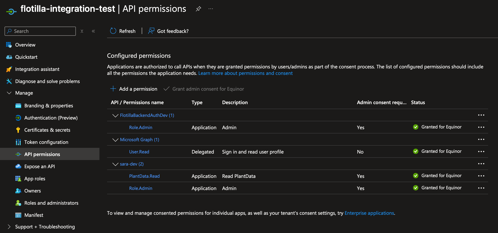

# Chapter 8 - Authentication

The conductors have been very happy lately, both with the new Train Logistics&trade; application and the older, but now
reliable, Tickets API. One thing they have been very impressed with is the authentication. They are so used to spending
a lot of time on multifactor authentication and remembering their password and in comparison your applications feel so
smooth.

What they don't know is that it's smooth because you have no authentication.

## Discussion: How to go about authentication?

First, we will not do the actual implementation in this workshop, instead we go the cowards way which is to "leave it as
an exercise for the reader". Why? Mainly to avoid dealing with the complexity of authentication and authorization in the
workshop setting combined with all the other new things. We will however go through how we have done it in our
integration tests and how you could do it in your application.

## Task 1: Authenticating the armada

The [armada repository](https://github.com/equinor/armada) is the integration test repository for the robotics team in
Equinor. It handles the setup and execution of integration tests where our applications, dependencies and multiple
robots are tested. The tests themselves are executed in the actual repositories, but the armada repository provides the
necessary fixtures and setup for the tests to run. If you dig into armada you will find that it reflects our workshop.

First, have a look at the readme in the repository and see which secrets we have required for the tests. For test
execution, ignore the "local development" section, we only require one.

The secret provides access to the "flotilla-integration-test" app registration which can be considered our user. It is
granted access to our relevant applications as seen in the image here. Note that we have opted to reuse our development
environments app registrations for the integration tests. You could also create a full duplicate environment for your
tests.

Now, have a look at the simplest test we have in the armada repository,
the [test that a simple robot mission is successful](https://github.com/equinor/armada/blob/main/robotics_integration_tests/test_simple_mission_is_successful.py)
test. The fixture we use, `armada_with_single_successful_robot: Armada`, is very similar to what we have covered in this
workshop. It's a wrapper class which contains several container objects. Furthermore, there are several wait functions
in this test which reflect the asynchronous nature of our application, things happen in parallel. However, there are
no clear signs of authentication yet.

If you look at
the [utilities to call our backend service](https://github.com/equinor/armada/blob/main/robotics_integration_tests/utilities/flotilla_backend_api.py)
and see the `_add_headers()` function, you will see that we add an "Authorization" header to the requests. Digging
deeper into the `retrieve_access_token_for_integration_tests_app()` function
in [authentication,py](https://github.com/equinor/armada/blob/main/robotics_integration_tests/utilities/authentication.py),
you can finally see how we are acquiring the token.

In essence, we treat our integration test execution as a user interacting with the application. The user executes
certain actions and inspects the different APIs and dependencies, calls to backend database, checks files in blob
storage etc. Based on the output we determine if the test is successful or not.

### Discussion: App-to-app vs on-behalf-of-user authentication

The robotics software system should, much like the robots themselves, be autonomous. This means that the application
should be able to perform its intended tasks without a user actively managing operations. Thus, the application is
implemented purely with an app-to-app based authentication flow. This enables us to perform authentication where one app
registration is given access, and we acquire tokens for the app registration.

If your application uses on-behalf-of-user authentication flow this will not work for you, and to be fair, most
applications likely do if they are user facing. We have currently not implemented an example for this, and as such the
solution is not given here, but we will discuss possibilities at the end of the chapter.

### Discussion: Is authentication worth it?

Given that authentication requires us to have a setup of app registrations, or even more complex solutions like an
entire Azure tenant, it might not be worth testing with authentication active. This will entirely depend on your system
and how complex it is. What is the main value of your integration tests? If it's primarily to test the logic when
interacting in-between your applications it might be enough value is provided without needing to do the full
authentication setup.

## Task 2: How could you implement on-behalf-of-user authentication in your tests?